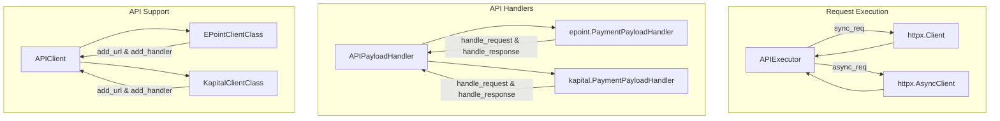
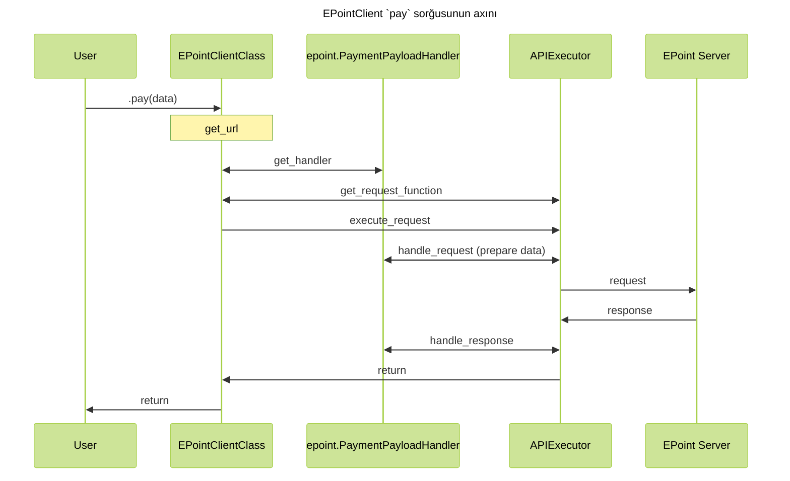

# Kod arxitekturası

## Bünovrə { #base }

İlk öncə sorğunun hansı prosesdən keçdiyinə nəzər salaq. Nəzərə alaq ki, EPoint və KapitalBank inteqrasiyası bərabər göstərilib.



## Axın { #code-flow }

Bu strukturu nəzərdən keçisəniz, sorğunun hazırlanıb, göndərilib, cavabın parse və
validate olunmasını bu diaqramdan anlaya bilərsiniz.



## İnteqrasiya strukturu  { #integration-structure }

Yeni inteqrasiya əlavə etmək istəyirsinizsə, zəhmət olmazsa [bu addımları](./contributing.md) icra etdiyinizdən əmin olun. Kod yazmaq hissəyə gəldikdə isə, növbəti mərhələləri izləyin:

### 1. File strukturu { #file-structure }

Gözlənilən əsas struktur budur:

```text
.
├── docs
│   ├── {lang}
│   │   ├── docs
│   │   │   ├── integrations
│   │   │   │   └── {integration-name}
│   │   │   │       ├── api-reference
│   │   │   │       │   ├── client.md
│   │   │   │       │   ├── enums.md
│   │   │   │       │   ├── helper-functions.md
│   │   │   │       │   └── response.md
│   │   │   │       ├── index.md
│   │   │   │       └── env.md
│   └── partial.yml
├── src
│   └── integrify
│       └── {integration-name}
│           ├── schemas
│           │   ├── __init__.py
│           │   ├── enums.py
│           │   ├── request.py
│           │   └── response.py
│           ├── __init__.py
│           ├── client.py
│           ├── env.py
│           ├── handlers.py
│           ├── helpers.py
│           └── py.typed
├── tests
│   ├── __init__.py
│   ├── conftest.py
│   ├── mocks.py
│   └── test.py
└── ...other files
```

Əlavə fayllar (məsələn, `utils.py`, `helpers.py`), və qovluqlar əlavə etmək olar, bu struktur sadəcə bünovrə fayllar üçün nəzərdə tutulub.

### 2. Hazırlıq və constant-lar { #preparation-and-constants }

İlk öncə istifadə edəcəyiniz API-ləri (endpoint) bir enum constantları kimi yığın. Əgər mühit dəyişənləri oxunmalıdırsa, onu da `env.py` faylında edin. Başqa ümumi və mühitlik bir hissə varsa, bir fayl atında toplanmalıdır.

### 3. Handler-lər { #handlers }

Növbəti olaraq, handler-ləri yazmağınız məsləhət görülür. Hər bir sorğu üçün, göndərilən (`schemas/request.py`) və qəbul edilən (`schemas/response.py`) datanın schema-sını yazın.

???+ warning

    Request üçün nəzərdə tutulmuş schema-ların field-lərini user-dən aldığınız ardıcıllıqda yazın!
    Yəni əgər sizin funksiyanız bu formatdadırsa:

    ```python
    def pay(amount: Decimal, currency: str)
    ```

    onda bu request üçün schema-dakı field-lərin ardıcıllığı:

    ```python
    class PaySchema(BaseModel):
        amount: Decimal
        currency: str
    ```

    olmalıdır. Əks halda, input data validation qarışa bilər, çünki, pozisional arqumentlərlər də işləyirik. 
    Daha ətraflı anlamaq üçün, [`PayloadBaseModel`][integrify.schemas.PayloadBaseModel]-ini araşdırın.

Request və response handler-lər hazır olduqdan sonra, hər API üçün bir handler yazıb, bu yazdığınız request və response schema-larını orda qeyd edin.

Nəzərə alın ki, əgər hər sorğu üçün, pre və ya post processing lazımdırsa, bunu schemalarda etmək əvəzinə, [`pre_handle_payload`][integrify.api.APIPayloadHandler.pre_handle_payload] və [`post_handle_payload`][integrify.api.APIPayloadHandler.post_handle_payload] funksiyalarını override etməklə eyni nəticəni əldə edə bilərsiniz. Misal üçün, EPoint-in handler-lərini nəzərdən keçirin.

### 4. API Klient { #api-client }

Bütün handler-lər hazır olduqdan sonra, yeni APIClient class-ı yaradıb, hər şeyi register etməlisiniz. Bir inteqrasiya üçün bir endpoint belə register olunur:

```python
class NewIntegrationClientClass(APIClient):

    def __init__(self, sync: bool = True):
        super().__init__('NewIntegration', 'https://new-integration.com', None, sync)

        self.add_url('function1', env.API.API1, 'GET')
        self.add_handler('function1', API1PayloadHandler)
```

Əgər API-lərin çoxu eyni handler ilə idarə oluna bilirsə, onda `default_handler` arqumentini `None` əvəzinə, o handler-i qeyd edə bilərsiniz. Yəni, kod əgər spesifik API üçün handler-i tapmazsa, default handler-i istifadə edəcək.

???+ note

    Məsləhət görülür ki, faylın sonunda sync və async clientləri obyekt kimi yaradıb, onları `new_integration/__init__.py`
    faylına import edəsiniz. Bu user-in istifadəsini asanlaşdırır; hər dəfə class-ı yaratmaq yerinə hazır sizin obyekti
    istifadə edir.

### 5. Type-hinted funksiyalar { #type-hinted-functions }

Bu hissənin kodun işləməsinə heç bir təsiri olmasa da, ən vacib hissələrdən biri hesab olunur. Nəzərə alın ki, bizim API klientlərin heç biri funksiya implement etmir; əvəzinə `__getattribute__` dunder metodu funksiyanın adından istifadə edərək, lazımı API və handler-ləri tapır, və onlara uyğun dinamik olaraq lambda funksiya yaradılır. Ona görə də `function1` adlandırılması vacibdir, çünki mövcud olmayan funksiyanın adıdır.

Konstruktorda bütün API və handlerlər register olunduqdan sonra, `if TYPE_CHECKING:` şərti altında funksiyalar yazılmalıdır. Funksiyaların bütün arqumentləri type-hint-lənməli və funksiyanın özünün docstring-i olmağı şərtdir, dokumentasiya generate edəndə buradan "oxuyur".

Misal kod parçası:

`````python
class NewIntegrationClientClass(APIClient):

    def __init__(self, sync: bool = True):
        super().__init__('NewIntegration', 'https://new-integration.com', None, sync)

        self.add_url('function1', env.API.API1, 'GET')
        self.add_handler('function1', API1PayloadHandler)

    if TYPE_CHECKING:

        def function1(
            self,
            amount: Decimal,
            currency: str,
        ) -> APIResponse[API1ResponseSchema]:
            """API sorğusu

            **Endpoint:** */api/function-1*

            Example:
                ```python
                from integrify.new_integration import NewIntegrationRequest

                NewIntegrationRequest.function1(amount=100, currency='AZN')
                ```

            **Cavab formatı**: `API1PayloadHandler`

            Bu sorğunu haqqında məlumat.

            Args:
                amount: Ödəniş miqdarı. Numerik dəyər.
                currency: Məzənnə.
            """

NewIntegrationClient = NewIntegrationClientClass(sync=True)
NewIntegrationAsyncClient = NewIntegrationClientClass(sync=False)
`````

### 6. Utils və Helpers { #utils-and-helpers }

Bəzən kod yazanda köməkçi funksiyalar lazım olur. Bunun üçün ayrı fayl yaradıb, funksiyaları ora yığın. Strukturu saxlamaq üçün adlandırmanı aşağıda qeyd edilən kimi etməyiniz xahiş olunur:

- utils.py - Daxili istifadəlik köməkçi funksiyalar üçün (bax: EPoint)
- helpers.py - User istifadəsi üçün köməkçi funksiyalar (bax: AzeriCard)

### 7. Testlər { #tests }

Testsiz, əlbəttə ki, olmaz) Test üçün, `pytest` istifadə olunur. `conftest.py` faylında, əsas fixture-ləri əlavə edin. `mocks.py` faylı isə, mock response fixture-ləri üçün nəzərdə tutulub. Ondan sonra, testlər üçün fayllar yaradıb, orada testlərinizi yazın. Test coverage-dən istifadə edərək, nəzərdən qaçırdığınız hissələri də görə bilərsiniz. Minimal gözlənilən test coverage-i: 95%.

### 8. Dokumentasiya { #documentation }

Kodun development-ini və testini bitirdikdən sonra, dokumentasiya yazmaq lazım olur. Template repository-dən istifadə etmişdinizsə, sizin üçün avtomatik markdown faylları da yaradılmışdır. Dəyişməli olduğunuz sadəcə markdown fayllarının kontentidir:

- `index.md`: İnteqrasiya haqqında ümumi məlumat, dokumentasiya linkləri və **dəstəklənən** API endpointləri və onların mənaları. Lazım olsa, ümumi istifadə haqqında da yazıla bilər.
- `env.md`: İstifadə olunan mühit dəyişənləri, onların mənaları və default dəyərləri. Həmçinin, user-lərin rahat kopyalaya biləcəyi .env template text bloku.
- `api-reference/client.md`: Client və onun funksiyaları haqqında.
- `api-reference/response.md`: Sorğu cavabı (response) schema-ları
- `api-reference/enums.md`: Enumlar listi (əgər varsa)
- `api-reference/helpers.md`: Köməkçi funksiyalar (əgər varsa).

Docstring-lər yazmısınızsa, [mkdocstrings](https://mkdocstrings.github.io/) aləti özü hər şeyi generasiya edəcəkdir.

Dokumentasiyanı bitirdikdən sonra, `make docs` kommandası ilə dokumentasiyanın səhvsiz generasiya edildiyindən əmin olun. Dokumentasiyanı görmək üçün `make docs-serve` edin, və console-da qeyd olunan addressi browser-də açın (adətən `localhost:8000` olur).

#### Partial.yml { #partial-yml }

Dokumentləşdirməni bitirdikdən sonra, partial.yml faylı yazmağınız **məcburidir**. Integrify multi-repo kitabxana olduğundan, dokumentasiya repository-si [ayrıcadır](https://github.com/Integrify-SDK/integrify-docs-python). Bu faylda sadəcə faylların adlarını və onlara olan path-i göstərəcəksiniz. Docs repositorysi build zamanı `partial.yml` faylını `mkdocs.yml` faylına "inteqrasiya" edir.

Misal partial.yml:

```md
EPoint:
  - "integrations/epoint/index.md"
  - "integrations/epoint/env.md"
  - API Referansı:
    - "integrations/epoint/api-reference/client.md"
    - Schemas:
      - Response: "integrations/epoint/api-reference/response.md"
      - Callback: "integrations/epoint/api-reference/callback.md"
    - "integrations/epoint/api-reference/helper-functions.md"
```
