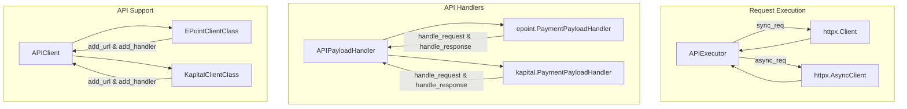
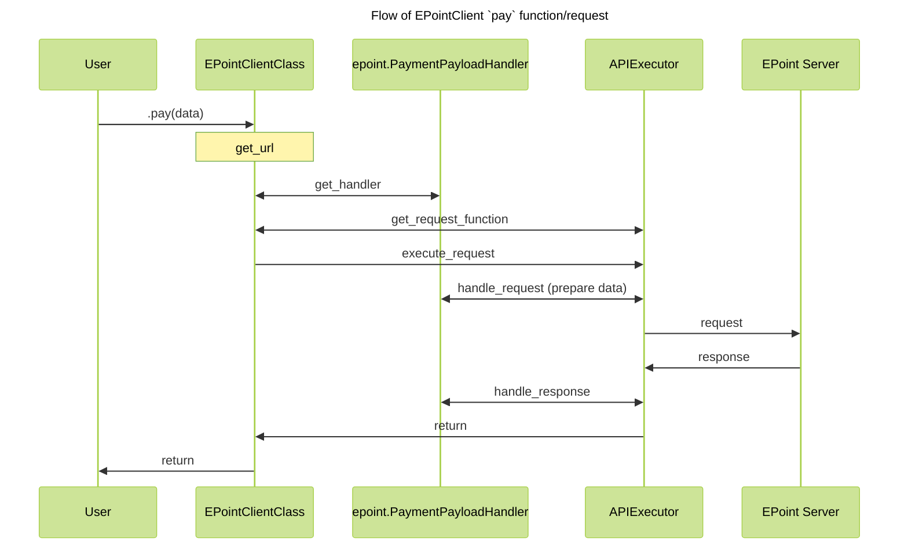

# Code Architecture

## Base { #base }

Let's first review the flow of a request. Consider that, we have two integrations: EPoint and KapitalBank.



## Code flow { #code-flow }

If you review this structure, you can understand from this diagram how the request is prepared, sent, and how the response is parsed and validated.



## Integration structure { #integration-structure }

If you want to add new integration support, please follow [these steps](./contributing.md).

### 1. File structure { #file-structure }

This is expected main file structure:

```text
.
├── docs
│   ├── {lang}
│   │   ├── docs
│   │   │   ├── integrations
│   │   │   │   └── {integration-name}
│   │   │   │       ├── api-reference
│   │   │   │       │   ├── client.md
│   │   │   │       │   ├── enums.md
│   │   │   │       │   ├── helper-functions.md
│   │   │   │       │   └── response.md
│   │   │   │       ├── about.md
│   │   │   │       └── env.md
│   └── partial.yml
├── src
│   └── integrify
│       └── {integration-name}
│           ├── schemas
│           │   ├── __init__.py
│           │   ├── enums.py
│           │   ├── request.py
│           │   └── response.py
│           ├── __init__.py
│           ├── client.py
│           ├── env.py
│           ├── handlers.py
│           ├── helpers.py
│           └── py.typed
├── tests
│   ├── __init__.py
│   ├── conftest.py
│   ├── mocks.py
│   └── test.py
└── ...other files
```

This is just skeleton. You can add extra files (for ex. `utils.py`, `helpers.py`) or folders.

### 2. Preperations and constants { #preparation-and-constants }

First of all, collect all APIs and endpoints under enum as constants. You can also read env variables (if needed) in `env.py` file.

### 3. Handlers { #handlers }

For next step, it is recommended to write handlers. For each endpoint, write schema of data of request (`schemas/request.py`) and response (`schemas/response.py`).

???+ warning

    For request schemas, have your fields IN THE SAME ORDER as your function paramaters. So if you function is:

    ```python
    def pay(amount: Decimal, currency: str)
    ```

    then schema of the request should be:

    ```python
    class PaySchema(BaseModel):
        amount: Decimal
        currency: str
    ```

    Otherwise, data could be messed up if user uses positional arguments instead of keyword ones. 
    For more info check, [`PayloadBaseModel`][integrify.schemas.PayloadBaseModel] schema.

After writing request and response schemas, write handler which points to them.

If you need pre or post request handling, instead of changing schemas, just override [`pre_handle_payload`][integrify.api.APIPayloadHandler.pre_handle_payload] və [`post_handle_payload`][integrify.api.APIPayloadHandler.post_handle_payload] of the handler class. For example, check EPoint handlers.

### 4. API Client { #api-client }

After writing all handlers, create APIClient class and register all endpoints and their handlers. For example:

```python
class NewIntegrationClientClass(APIClient):

    def __init__(self, sync: bool = True):
        super().__init__('NewIntegration', 'https://new-integration.com', None, sync)

        self.add_url('function1', env.API.API1, 'GET')
        self.add_handler('function1', API1PayloadHandler)
```

If most of the APIs use the same handler, add `default_handler` to `__init__` of ClientCLass. If there is no given handler for api, default handler is used.

???+ note

    It is recommended to add sync and async instances of client. at the end of `client.py` file and add them to
    new_integration/__init__.py file. This allows user to directly use instances, instead of creating one for each request.

### 5. Type-hinted functions { #type-hinted-functions }

Even though this part has no direct effect to the library, it is one of the main parts of the library. As you can see, there is no function defined in the library: each request function is dynamically created when called in `__getattribute__` dunder method using lambda functions. That is why, `function1` is important name, as it is also the name of the function (i. e. you can call `client.function1(args)`)

After registering all endpoitns and handlers add all function signatures under `if TYPE_CHECKING:`. All functions should be documented with docstring and their arguments should be type-hinted, as [`mkdocstrings`](https://mkdocstrings.github.io/) is used for doc generation, which uses all of these.

Code example:

`````python
class NewIntegrationClientClass(APIClient):

    def __init__(self, sync: bool = True):
        super().__init__('NewIntegration', 'https://new-integration.com', None, sync)

        self.add_url('function1', env.API.API1, 'GET')
        self.add_handler('function1', API1PayloadHandler)

    if TYPE_CHECKING:

        def function1(
            self,
            amount: Decimal,
            currency: str,
        ) -> APIResponse[API1ResponseSchema]:
            """What api does

            **Endpoint:** */api/function-1*

            Example:
                ```python
                from integrify.new_integration import NewIntegrationRequest

                NewIntegrationRequest.function1(amount=100, currency='AZN')
                ```

            **Request schema**: `API1PayloadHandler`

            A little about request.

            Args:
                amount: Request amount.
                currency: Request currency.
            """

NewIntegrationClient = NewIntegrationClientClass(sync=True)
NewIntegrationAsyncClient = NewIntegrationClientClass(sync=False)
`````

### 6. Utils and Helpers { #utils-and-helpers }

Sometimes we need extra functions to write code. For this, create a separate file and add your codes there. In order to keep structure, it is requested to follow the following format:

- utils.py - For internal use (check) Daxili istifadəlik köməkçi funksiyalar üçün (check: EPoint)
- helpers.py - Extra functions for users to use (check: AzeriCard)

### 7. Tests { #tests }

Of course, we could not be without a test. Pytest is used for testing. Write main fixtures in the `conftest.py` file. `mocks.py` file is for mock responses. Then write bunch of tests to cover all the requests. Expected minimum coverage: 95%.

### 8. Documentation { #documentation }

After finished development and testing, we need to get down to documenting.  All you need to do is change content of some predefined markdown files:

- `about.md`: General info about integration, links to documentations, table of **implemented** requests and maybe some info about usage.
- `env.md`: List of env variables, what they mean and their default values. Also, small text block .env tempalge for users to easily copy paste.
- `api-reference/client.md`: About client and documented functions
- `api-reference/response.md`: Response schemas
- `api-reference/enums.md`: List of enums, if any
- `api-reference/helpers.md`: helper file documentation, if any.

If you have followed the steps this far, you have already typed and documented code. [Mkdocstrings](https://mkdocstrings.github.io/) will generate everything for us.

After finishing documenting, run `make docs` to make sure there is no error in build. To see the documentation, run `make docs-serve` and open address shown in console (usually `localhost:8000`).

#### Partial.yml { #partial-yml }

After all markdown files is written, for it to work, we **must** write `partial.yml` file. As Integrify is multi-repo library, documentation repository is [separate](https://github.com/Integrify-SDK/integrify-docs-python). Script in this repo takes `partial.yml` file and embeds it to its `mkdocs.yml`, generating documentation for each library.

Example `partial.yml`:

```md
EPoint:
  - "integrations/epoint/about.md"
  - "integrations/epoint/env.md"
  - API Reference:
    - "integrations/epoint/api-reference/client.md"
    - Schemas:
      - Response: "integrations/epoint/api-reference/response.md"
      - Callback: "integrations/epoint/api-reference/callback.md"
    - "integrations/epoint/api-reference/helper-functions.md"
```
